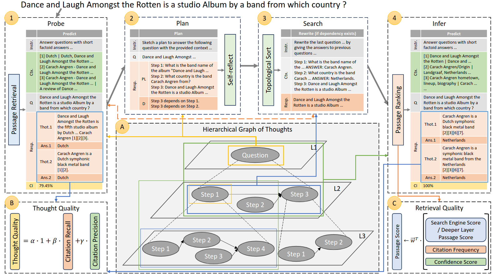
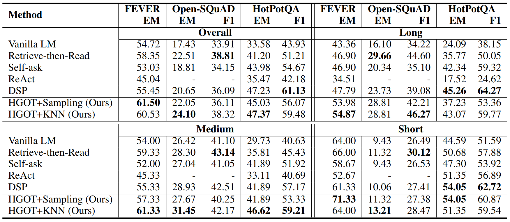
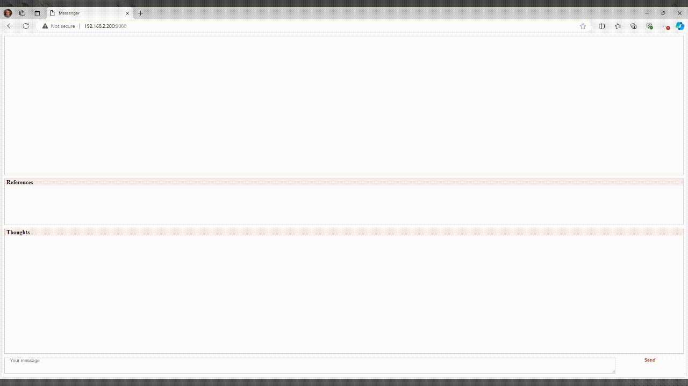

# HGOT: Hierarchical Graph of Thoughts for Retrieval-Augmented In-Context Learning in Factuality Evaluation
With the widespread adoption of large language models (LLMs) in numerous applications, the challenge of factuality and the propensity for hallucinations has emerged as a significant concern. To address this issue, particularly in retrieval-augmented in-context learning, we introduce the hierarchical graph of thoughts (HGOT), a structured, multi-layered graph approach designed to enhance the retrieval of pertinent passages during in-context learning. The framework utilizes the emergent planning capabilities of LLMs, employing the divide-and-conquer strategy to break down complex queries into manageable sub-queries. It refines self-consistency majority voting for answer selection, which incorporates the recently proposed citation recall and precision metrics to assess the quality of thoughts, linking an answer's credibility intrinsically to the thought's quality. This methodology introduces a weighted system in majority voting, prioritizing answers based on the citation quality of their thoughts. Additionally, we propose a scoring mechanism for evaluating retrieved passages, considering factors such as citation frequency and quality, self-consistency confidence, and the retrieval module's ranking. Experiments indicate that HGOT excels as a versatile approach, outperforming competing models in FEVER by up to 7% and matching leading models such as Retrieve-then-Read in Open-SQuAD, and DSP in HotPotQA, demonstrating its efficacy in enhancing LLMs' factuality.




## Features

**Planner (Reasoner):** Breaks down complex queries into manageable sub-questions (sub-goals) and identifies their interdependencies.

**Thought Quality:** HGOT selects the best answer using a voting mechanism that assesses thought quality with citation recall and precision metrics.

**Retrieval Quality:** Provides a scoring mechanism for evaluating retrieved passages based on citation frequency and quality, self-consistency confidence, and retrieval module ranking.

**Evaluation Platform:** An extensible framework that evaluates HGOT's performance across multiple metrics (e.g., Exact Match and F1), using various LLMs (e.g., ChatGPT, Llama, Qwen, and DeepSeek-R1 models), diverse retrieval models (e.g., Google and ColBERT), and a range of datasets (e.g., FEVER, Open-SQuAD, HotPotQA), with an emphasis on sampling from the extremes of the distribution.

**Web-based Inspection Panel:** Inspects LLM generation, confidence, latency, retrieval quality, citation quality, and the Planner (Reasoner)’s ability to deduce the hierarchical graph of thoughts.
(We thank McMaster University for supporting the development of this feature in collaboration with the WiSeR research group: https://wiser.cas.mcmaster.ca/.)


## Evaluation Platform
HGOT provides a ready-to-use evaluation platform for benchmarking its performance on custom datasets across various application domains. To test this platform, start by downloading the FEVER, Open-SQuAD, and HotPotQA datasets, then run a designated Python script. The evaluation results on these datasets are also presented below.

#### Dataset Download

FEVER:
```
curl -o data/FEVER/train.jsonl https://fever.ai/download/fever/train.jsonl
curl -o data/FEVER/paper_dev.jsonl https://fever.ai/download/fever/paper_dev.jsonl
curl -o data/FEVER/paper_test.jsonl https://fever.ai/download/fever/paper_test.jsonl
python3 -c "from data import preprocess_data; preprocess_data('fever')"
```

Open-SQuAD: 
```
curl -o data/Open-SQuAD/biencoder-squad1-train.json.gz https://dl.fbaipublicfiles.com/dpr/data/retriever/biencoder-squad1-train.json.gz
curl -o data/Open-SQuAD/biencoder-squad1-dev.json.gz https://dl.fbaipublicfiles.com/dpr/data/retriever/biencoder-squad1-dev.json.gz
curl -o data/Open-SQuAD/squad1-test.qa.csv https://dl.fbaipublicfiles.com/dpr/data/retriever/squad1-test.qa.csv
python3 -c "from data import preprocess_data; preprocess_data('open-squad')"
```

HotPotQA: 
```
curl -o data/HotPotQA/hotpot_train_v1.1.json http://curtis.ml.cmu.edu/datasets/hotpot/hotpot_train_v1.1.json
curl -o data/HotPotQA/hotpot_dev_fullwiki_v1.json http://curtis.ml.cmu.edu/datasets/hotpot/hotpot_dev_fullwiki_v1.json
python3 -c "from data import preprocess_data; preprocess_data('hotpotqa')"
```

QReCC: (Optional)
```
curl -o data/QReCC/qrecc_data.zip https://github.com/apple/ml-qrecc/blob/main/dataset/qrecc_data.zip
unzip data/QReCC/qrecc_data.zip -d data/QReCC/
python3 -c "from data import preprocess_data; preprocess_data('qrecc')"
```

FELM: (Optional)
```
curl -o data/FELM/all.jsonl https://huggingface.co/datasets/hkust-nlp/felm/blob/main/all.jsonl
python3 -c "from data import preprocess_data; preprocess_data('felm')"
```

#### Command for Evaluation

Execute `python3 evaluation.py` to assess HGOT across multiple datasets and language models.

#### Experimental Results

The evaluation results for ChatGPT-3.5 and the Google retrieval model are presented below:



## Web-based Inspection Panel

HGOT includes a basic web-based user interface for inspection purposes. To launch it, execute the command `python3 portal.py` and access `127.0.0.1:9080` via a web browser.



#### Language Model Configuration
Currently, HGOT supports various models, including OpenAI's GPT series (e.g., gpt-3.5-turbo, gpt-4, gpt-4-turbo, gpt-4o, gpt-4o-mini, o1, o1-mini, o3-mini), Llama models (e.g., llama3.3:70b), Qwen models (e.g., qwen2.5:7b, qwen2.5:14b, qwen2.5:32b, qwen2.5:72b), and DeepSeek-R1 models (e.g., deepseek-r1:7b, deepseek-r1:8b, deepseek-r1:14b, deepseek-r1:32b, deepseek-r1:70b, deepseek-r1:671b).

To configure the language model for the web-based user interface, navigate to `config/config.json` and update the "lm" value with one of the supported language models listed above.
```
{
	"rm":"google",
	"lm":"gpt-3.5-turbo-1106",
	"lm_max_tokens":300
}
```


## Citation
If you use our source code in a research paper, please cite our work as follows:

```
@inproceedings{fang-etal-2024-hgot,
    title = "{HGOT}: Hierarchical Graph of Thoughts for Retrieval-Augmented In-Context Learning in Factuality Evaluation",
    author = "Fang, Yihao  and
      Thomas, Stephen  and
      Zhu, Xiaodan",
    editor = "Ovalle, Anaelia  and
      Chang, Kai-Wei  and
      Cao, Yang Trista  and
      Mehrabi, Ninareh  and
      Zhao, Jieyu  and
      Galstyan, Aram  and
      Dhamala, Jwala  and
      Kumar, Anoop  and
      Gupta, Rahul",
    booktitle = "Proceedings of the 4th Workshop on Trustworthy Natural Language Processing (TrustNLP 2024)",
    month = jun,
    year = "2024",
    address = "Mexico City, Mexico",
    publisher = "Association for Computational Linguistics",
    url = "https://aclanthology.org/2024.trustnlp-1.12/",
    doi = "10.18653/v1/2024.trustnlp-1.12",
    pages = "118--144"
}
```
